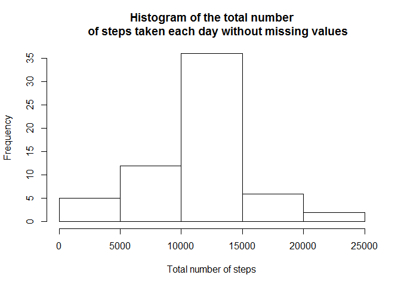

### Introduction

It is now possible to collect a large amount of data about personal movement using activity monitoring devices such as a Fitbit, Nike Fuelband, or Jawbone Up. These type of devices are part of the "quantified self" movement - a group of enthusiasts who take measurements about themselves regularly to improve their health, to find patterns in their behavior, or because they are tech geeks. But these data remain under-utilized both because the raw data are hard to obtain and there is a lack of statistical methods and software for processing and interpreting the data.  

This assignment makes use of data from a personal activity monitoring device. This device collects data at 5 minute intervals through out the day. The data consists of two months of data from an anonymous individual collected during the months of October and November, 2012 and include the number of steps taken in 5 minute intervals each day.  

### Description of the dataset

The data for this assignment can be downloaded from the course web site.

The variables included in this dataset are:

  - Steps: Number of steps taking in a 5-minute interval (missing values are coded as red)
  - Date: The date on which the measurement was taken in YYYY-MM-DD format
  - Interval: Identifier for the 5-minute interval in which measurement was taken

The dataset is stored in a comma-separated-value (CSV) file and there are a total of 17,568 observations in this dataset.

### Structure of this document

  - Code for reading in the dataset and/or processing the data
  - Histogram of the total number of steps taken each day
  - Mean and median number of steps taken each day
  - Time series plot of the average number of steps taken
  - The 5-minute interval that, on average, contains the maximum number of steps
  - Code to describe and show a strategy for imputing missing data
  - Histogram of the total number of steps taken each day after missing values are imputed.
  - Panel plot comparing the average number of steps taken per 5-minute interval across weekdays and weekends
  - All of the R code needed to reproduce the results (numbers, plots, etc.) in the report


####1. Code for reading in the dataset and/or processing the data


```r
library(dplyr)
```

```
## 
## Attaching package: 'dplyr'
```

```
## The following objects are masked from 'package:stats':
## 
##     filter, lag
```

```
## The following objects are masked from 'package:base':
## 
##     intersect, setdiff, setequal, union
```

```r
library(ggplot2)

data <- read.csv("activity.csv")
```

####2. Histogram of the total number of steps taken each day


```r
data_steps_day <- data %>% 
  group_by(date) %>% 
  summarize(steps_day_total =sum(steps, na.rm=T))

#Histogram of the total number of steps taken each day
hist(data_steps_day$steps_day_total, main = "Histogram of the total number
     of steps taken each day ", xlab= "Total number of steps")
```

<!-- -->

####3. Mean and median number of steps taken each day


```r
mean(data_steps_day$steps_day_total)
```

```
## [1] 9354.23
```

```r
median(data_steps_day$steps_day_total)
```

```
## [1] 10395
```

The mean and median number of steps taken each day are 9354 and 10395 respectively.


####4. Time series plot of the average number of steps taken


```r
data_steps_interval <- data %>% 
  group_by(interval) %>% 
  summarize(steps_interval_total =sum(steps, na.rm=T))

steps_int_average <- data_steps_interval$steps_interval_total/61

df <- data.frame(steps_int_average, unique(data$interval))
names(df) <- c("Average_steps", "Interval")

ggplot(df, aes(x = Interval, y = Average_steps)) +
  geom_line()+
  labs(title = "Time series plot of the average number of steps taken")
```

<!-- -->

####5. The 5-minute interval that, on average, contains the maximum number of steps


```r
int_maxsteps <- df[which.max(df$Average_steps),2] 
```

The 5-minute interval that, on average, contains the maximum number of steps is 835.

####6. Code to describe and show a strategy for imputing missing data

Missing data has been imputed following the strategy shown below:
  a) Count the total number of NA  
  b) Compute the mean of the number steps of the whole dataset  
  c) Replace NA by the mean computed  
  

```r
#Calculate and report the total number of missing values in the dataset
table(is.na(data$steps))
```

```
## 
## FALSE  TRUE 
## 15264  2304
```

```r
#Devise a strategy for filling in all of the missing values in the dataset.
vector <- data$steps
vector[is.na(vector)]<-mean(vector,na.rm=TRUE)
newdata <- data.frame(vector, data$date, data$interval)
names(newdata) <- c("steps", "date", "interval")
```
  The total number of NA is 2304.  
  

####7. Histogram of the total number of steps taken each day after missing values are imputed


```r
steps_day <- newdata %>% 
  group_by(date) %>% 
  summarize(steps_day_total = sum(steps))

hist(steps_day$steps_day_total, main = "Histogram of the total number
     of steps taken each day without missing values ", xlab= "Total number of steps")
```

<!-- -->

```r
mean(steps_day$steps_day_total)
```

```
## [1] 10766.19
```

```r
median(steps_day$steps_day_total)
```

```
## [1] 10766.19
```
  The mean and median total number of steps taken per day are 10766.19 and 10766.19 respectively.   
  It can be seen that both mean and median have increased.

####8. Panel plot comparing the average number of steps taken per 5-minute interval across weekdays and weekends


```r
newdata$day <- weekdays(as.POSIXct(data$date))
newdata$days<-ifelse(newdata$day=="sábado"|newdata$day=="domingo","weekend","weekday")

steps_average_days <- newdata%>% 
  group_by(days, interval) %>% 
  summarize(steps_days_total = mean(steps))


ggplot(aes(x=interval,y=steps_days_total),data=steps_average_days)+
  geom_line()+
  facet_wrap(~steps_average_days$days)+
  ylab("Average number of steps")
```

<!-- -->

